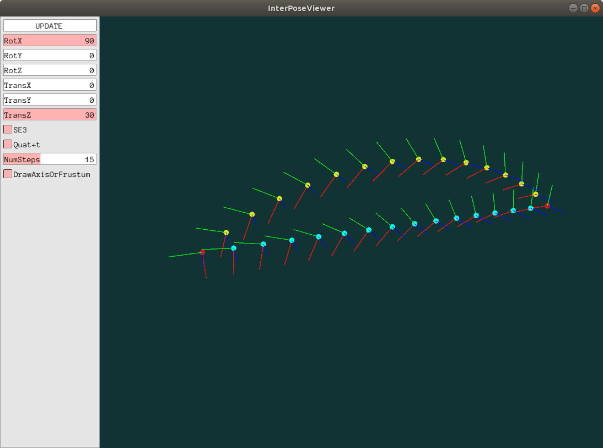

# InterPose
Interpolation-Pose algorithms implementation.  
I implemented 2 methods.   
1. Quarternion + R^3 Interpolation  
Generally pose is described by rotation and translation. In this method, rotation is interpolated by Quarternion slerp, and translation is interpolated linearly. Interpolated trajectory generated by this is a street line. 
2. SE(3) Interpolation  
In this method, pose is described by SE(3). If you need smooth trajectory, this is better.

## How to use
```bash
git clone --recursive git@github.com:cashiwamochi/InterPose.git
chmod +x first_build.sh
./first_build.sh
./build/bin/exampleInterPoseViewer
./build/bin/exampleInterPose
```
`exampleInterPose.cc` shows you how to use.  
`viewer/exampleInterPoseViewer.cc` shows you each trajectory. Of course you can try various params.

## Example(exampleInterPoseViewer)
Red poses are source pose and destination pose. Yellow poses are generated by SE3-interpolation and blue poses are generated by Quat+R^3-interpolation. 



### Dependencies
I use [Pangolin](https://github.com/stevenlovegrove/Pangolin) and [Eigen](https://gitlab.com/libeigen/eigen).
Those modules have been registered as submodule in this repository, so plase don't forget `--recursive` when you clone.

### References
[Papar_for_SE3_SO3](https://gist.github.com/cashiwamochi/05df51370ccd1d14827fbbaba88e9cce)

## なにこれ
オドメトリやSfMをやると，フレーム間の姿勢を補間したいと思うときが時々ある．
そんなときに使えるような補間アルゴリズムを軽くまとめた．
姿勢を位置と回転に分離して補間する場合は`QuatAntTInterpolator`を，あくまで剛体運動する物体に対し補間をしたい場合は`SE3Interpolator`を使う．
`exampleInterPoseViewer`で好きな姿勢を設定して補間できるので，ちゃんと動くか確認する場合はそちらをおすすめ．
簡潔な使い方を知りたい場合には，`exampleInterPose.cc`を読むと良い．
